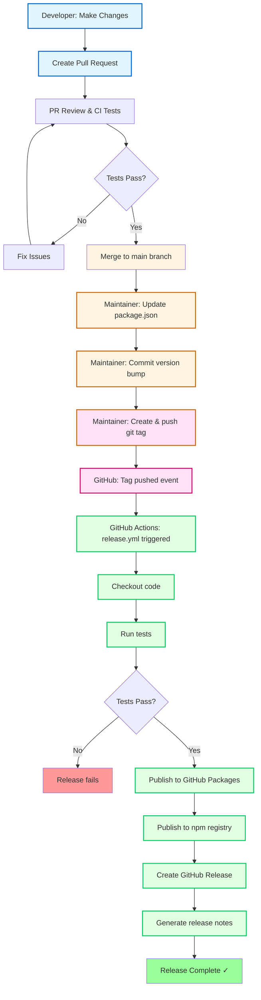
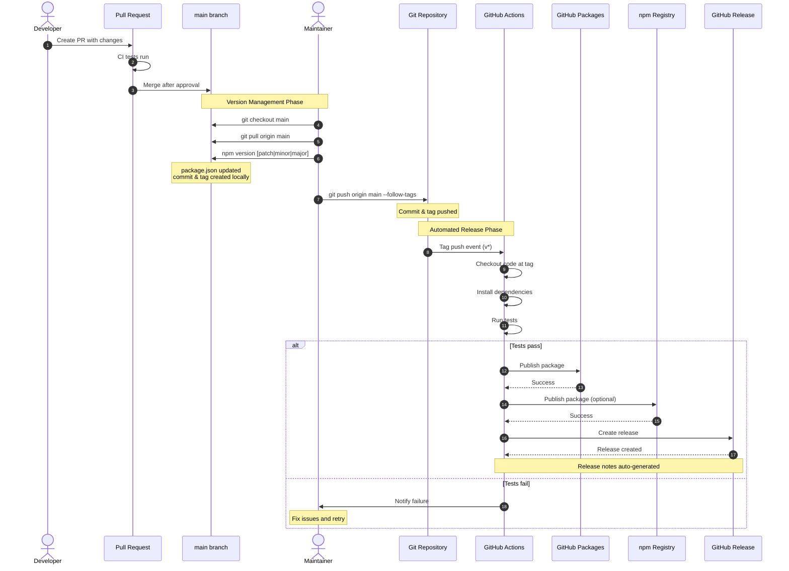

# Contributing to overload-protection

Thank you for your interest in contributing to overload-protection! This document provides guidelines for contributing to the project, with a focus on managing semantic versioning and releases.

## Table of Contents

- [Getting Started](#getting-started)
- [Development Workflow](#development-workflow)
- [Semantic Versioning](#semantic-versioning)
- [Release Process](#release-process)
- [Code Style](#code-style)
- [Testing](#testing)

## Getting Started

1. Fork the repository
2. Clone your fork: `git clone https://github.com/YOUR_USERNAME/overload-protection.git`
3. Install dependencies: `npm install`
4. Create a feature branch: `git checkout -b feature/your-feature-name`

## Development Workflow

### Running Tests

```bash
npm test              # Run all tests
npm run cov           # Run tests with coverage
npm run covr          # Generate HTML coverage report
```

### Linting

```bash
npm run lint          # Check code style
```

### Benchmarks

```bash
npm run benchmarks    # Run performance benchmarks
```

## Semantic Versioning

This project follows [Semantic Versioning 2.0.0](https://semver.org/). Version numbers use the format `MAJOR.MINOR.PATCH`:

- **MAJOR** version: Incompatible API changes
- **MINOR** version: Backwards-compatible functionality additions
- **PATCH** version: Backwards-compatible bug fixes

### Examples

- `1.0.0` → `2.0.0`: Breaking change (e.g., changed function signature, removed options)
- `1.0.0` → `1.1.0`: New feature (e.g., added new threshold type, new framework support)
- `1.0.0` → `1.0.1`: Bug fix (e.g., fixed memory leak, corrected threshold calculation)

### Determining Version Bump

Use this decision tree to determine which version component to increment:

**Does your change break existing code?**
- YES → Increment MAJOR version
- NO → Continue...

**Does your change add new functionality?**
- YES → Increment MINOR version
- NO → Continue...

**Does your change fix a bug or improve documentation?**
- YES → Increment PATCH version

### Pre-release Versions

For testing releases before they're ready for production, use pre-release identifiers:

- `2.1.0-alpha.1` - Alpha release
- `2.1.0-beta.1` - Beta release
- `2.1.0-rc.1` - Release candidate

## Release Process

The release process is fully automated through GitHub Actions. Here's how it works:

### Release Flow Diagram



### Step-by-Step Release Instructions

#### 1. Merge Changes to Main

First, ensure all changes have been merged to the `main` branch through the normal PR process:

1. Create a pull request with your changes
2. Ensure all CI tests pass
3. Get approval from maintainers
4. Merge the PR to `main`

#### 2. Update Package Version

After merging to `main`, a maintainer must update the version in `package.json`:

```bash
# Checkout main branch and pull latest changes
git checkout main
git pull origin main

# Update version based on semantic versioning rules
# For PATCH release (bug fixes):
npm version patch

# For MINOR release (new features):
npm version minor

# For MAJOR release (breaking changes):
npm version major

# For pre-release (from a regular version):
npm version prepatch --preid=alpha   # Creates X.Y.Z-alpha.0 from X.Y.Z
npm version preminor --preid=alpha   # Creates X.Y.0-alpha.0 from X.Y.Z
npm version premajor --preid=alpha   # Creates X.0.0-alpha.0 from X.Y.Z

# For subsequent pre-releases (when already on a pre-release version):
npm version prerelease --preid=alpha # Increments: X.Y.Z-alpha.0 -> X.Y.Z-alpha.1
```

**What `npm version` does:**
1. Updates the `version` field in `package.json`
2. Creates a git commit with the message "X.Y.Z"
3. Creates a git tag `vX.Y.Z`

#### 3. Push the Version Tag

Push both the commit and the tag to GitHub:

```bash
# Push the version commit and tag
git push origin main --follow-tags
```

**Important:** The `--follow-tags` flag ensures the tag is pushed along with the commit.

#### 4. Automated Release

Once the tag is pushed, GitHub Actions automatically:

1. **Triggers the release workflow** (`.github/workflows/release.yml`)
2. **Runs tests** to ensure code quality
3. **Publishes to GitHub Packages** (`@andylockran/overload-protection`)
4. **Publishes to npm registry** (if `NPM_TOKEN` secret is configured)
5. **Creates a GitHub Release** with auto-generated release notes

### Verification

After the release completes:

1. **Check GitHub Actions**: Visit the [Actions tab](https://github.com/andylockran/overload-protection/actions) to verify the workflow succeeded
2. **Check GitHub Releases**: Visit the [Releases page](https://github.com/andylockran/overload-protection/releases) to see the new release
3. **Check GitHub Packages**: Visit the [Packages tab](https://github.com/andylockran/overload-protection/pkgs/npm/overload-protection) to verify the package was published
4. **Test installation**: Try installing the new version:
   ```bash
   npm install @andylockran/overload-protection@X.Y.Z
   ```

### Release Sequence Diagram



### Manual Release (Emergency Only)

If you need to trigger a release manually without creating a new tag:

1. Go to the [Actions tab](https://github.com/andylockran/overload-protection/actions)
2. Select the "Release Package" workflow
3. Click "Run workflow"
4. Select the branch
5. Click "Run workflow"

**Note:** This should only be used in emergencies, as it bypasses version control.

## Version Management Best Practices

### DO ✅

- **Always update `package.json` version** before creating a release tag
- **Use `npm version`** command to ensure consistency
- **Follow semantic versioning** strictly
- **Write meaningful commit messages** for version bumps
- **Test thoroughly** before releasing
- **Document breaking changes** in PR descriptions

### DON'T ❌

- **Don't manually edit** the version in `package.json` without creating a matching tag
- **Don't push tags** without pushing the corresponding commit
- **Don't skip versions** (e.g., going from 1.0.0 to 1.0.2)
- **Don't reuse tags** (delete and recreate)
- **Don't create tags** on feature branches (only on `main`)

### Common Mistakes

#### Mistake 1: Tag without Version Bump

```bash
# ❌ WRONG: Creating tag without updating package.json
git tag v2.0.2
git push origin v2.0.2
# Result: package.json still shows v2.0.1, release is inconsistent
```

```bash
# ✅ CORRECT: Use npm version
npm version patch
git push origin main --follow-tags
# Result: package.json and tag are synchronized
```

#### Mistake 2: Version Bump without Tag

```bash
# ❌ WRONG: Updating package.json without creating tag
# Edit package.json manually: "version": "2.0.2"
git commit -m "Bump version"
git push origin main
# Result: No tag created, no release triggered
```

```bash
# ✅ CORRECT: Use npm version (creates both commit and tag)
npm version patch
git push origin main --follow-tags
```

#### Mistake 3: Forgetting --follow-tags

```bash
# ❌ WRONG: Pushing without tags
npm version patch
git push origin main
# Result: Commit pushed but tag remains local, no release triggered
```

```bash
# ✅ CORRECT: Push with --follow-tags
npm version patch
git push origin main --follow-tags

# Or push commit and specific tag separately:
npm version patch
git push origin main
git push origin v$(node -p "require('./package.json').version")
```

## Code Style

This project uses [StandardJS](https://standardjs.com/) for code style:

- No semicolons
- 2-space indentation
- Single quotes for strings
- Run `npm run lint` before committing

## Testing

### Test Structure

- **Unit tests**: `test/index.js` - Core functionality
- **Integration tests**: `test/integration/` - Framework-specific tests
- **Benchmarks**: `benchmarks/` - Performance tests

### Writing Tests

- Use Vitest for all tests
- Tests run sequentially (`threads: false` in `vitest.config.js`)
- Always call `instance.stop()` in cleanup to prevent timer leaks
- Use `setImmediate()` for event loop timing, not `setTimeout()`

### Test Coverage

Aim for high test coverage:

```bash
npm run cov          # View coverage in terminal
npm run covr         # Generate HTML report
```

## Pull Request Guidelines

1. **Branch naming**: Use descriptive names (e.g., `feature/add-fastify-support`, `fix/memory-leak`)
2. **Commit messages**: Write clear, concise messages
3. **Tests**: Add tests for new features
4. **Documentation**: Update README.md if needed
5. **Breaking changes**: Clearly mark in PR description

## Questions?

If you have questions about contributing or the release process:

1. Check existing [issues](https://github.com/andylockran/overload-protection/issues)
2. Open a new issue with the question
3. Tag it with `question` label

## License

By contributing, you agree that your contributions will be licensed under the MIT License.
