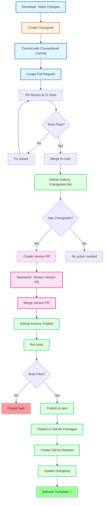
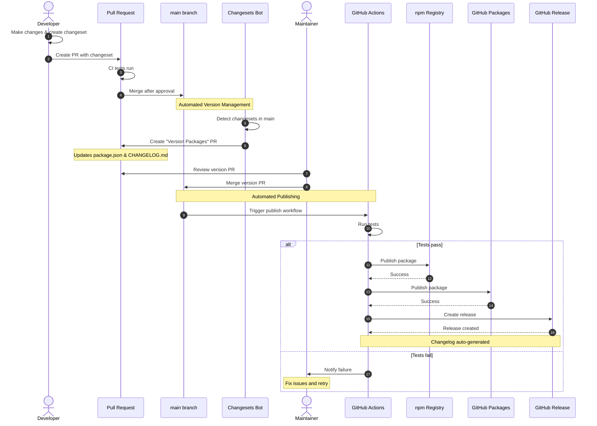

# Contributing to overload-protection

Thank you for your interest in contributing to overload-protection! This document provides guidelines for contributing to the project, with a focus on managing semantic versioning and releases using Changesets.

## Table of Contents

- [Getting Started](#getting-started)
- [Development Workflow](#development-workflow)
- [Version Management with Changesets](#version-management-with-changesets)
- [Conventional Commits](#conventional-commits)
- [Release Process](#release-process)
- [Code Style](#code-style)
- [Testing](#testing)

## Getting Started

1. Fork the repository
2. Clone your fork: `git clone https://github.com/YOUR_USERNAME/overload-protection.git`
3. Install dependencies: `npm install`
4. Create a feature branch: `git checkout -b feature/your-feature-name`

## Development Workflow

### Running Tests

```bash
npm test              # Run all tests
npm run cov           # Run tests with coverage
npm run covr          # Generate HTML coverage report
```

### Linting

```bash
npm run lint          # Check code style
```

### Benchmarks

```bash
npm run benchmarks    # Run performance benchmarks
```

## Version Management with Changesets

This project uses [Changesets](https://github.com/changesets/changesets) to manage versions and changelogs. Changesets automates the versioning process based on your changes and ensures proper semantic versioning.

### What are Changesets?

Changesets are files that describe the changes you've made and their impact on the version number. Each changeset includes:

- **Type of change**: `major`, `minor`, or `patch`
- **Description**: What changed and why

### Creating a Changeset

After making your changes, create a changeset:

```bash
npm run changeset
```

This will prompt you to:

1. **Select the type of change**:
   - `major` - Breaking changes (e.g., changed function signature, removed options)
   - `minor` - New features (e.g., added new threshold type, framework support)
   - `patch` - Bug fixes (e.g., fixed memory leak, corrected threshold calculation)

2. **Write a summary**: Describe your change clearly

The changeset file will be created in the `.changeset` directory and should be committed along with your code changes.

### Example Workflow

```bash
# 1. Make your changes
git checkout -b fix/memory-leak
# ... edit files ...

# 2. Create a changeset
npm run changeset
# Select: patch
# Summary: "Fix memory leak in event loop monitoring"

# 3. Commit everything together
git add .
git commit -m "fix: memory leak in event loop monitoring"

# 4. Push and create PR
git push origin fix/memory-leak
```

## Conventional Commits

This project follows the [Conventional Commits](https://www.conventionalcommits.org/) specification for commit messages. This provides an easy set of rules for creating an explicit commit history.

### Commit Message Format

```
<type>[optional scope]: <description>

[optional body]

[optional footer(s)]
```

### Types

- **feat**: A new feature (minor version bump)
- **fix**: A bug fix (patch version bump)
- **docs**: Documentation only changes
- **style**: Code style changes (formatting, semicolons, etc.)
- **refactor**: Code changes that neither fix a bug nor add a feature
- **perf**: Performance improvements
- **test**: Adding or updating tests
- **chore**: Maintenance tasks (e.g., dependencies, configs)
- **ci**: Changes to CI/CD configuration

### Breaking Changes

For breaking changes (major version bump), add `!` after the type or include `BREAKING CHANGE:` in the footer:

```bash
feat!: change API signature for protect function

BREAKING CHANGE: The protect function now requires options as the second parameter
```

### Examples

```bash
# Patch version - bug fix
fix: correct threshold calculation in memory monitor

# Minor version - new feature
feat: add support for Fastify framework

# Major version - breaking change
feat!: change middleware signature to accept config object

# Documentation
docs: update README with new examples

# Chore
chore: update dependencies to latest versions
```

### Relationship with Changesets

While Changesets determine the version bump, Conventional Commits provide a consistent commit history that makes it easier to:

- Understand the project history
- Generate meaningful changelogs
- Identify the scope and impact of changes

**Best Practice**: Use Conventional Commits for your commit messages AND create a changeset for changes that affect the package version.

## Release Process

The release process is fully automated through GitHub Actions and Changesets.

### Release Flow Diagram



### How It Works

1. **Developer Workflow**:
   - Make code changes
   - Run `npm run changeset` to create a changeset
   - Commit changes with conventional commit message
   - Create pull request

2. **PR Merge**:
   - Once PR is approved and tests pass, merge to `main`

3. **Changesets Bot**:
   - Detects changesets in `main` branch
   - Automatically creates a "Version Packages" PR
   - This PR updates `package.json` version and `CHANGELOG.md`

4. **Version PR Merge**:
   - Maintainer reviews and merges the Version PR
   - This triggers the publish workflow

5. **Automated Publishing**:
   - Runs tests one final time
   - Publishes to npm registry
   - Publishes to GitHub Packages
   - Creates GitHub Release with notes
   - Updates changelog

### Sequence Diagram



### What Happens Automatically

✅ **Version bumping**: Based on changeset type (major/minor/patch)  
✅ **Changelog generation**: From changeset descriptions  
✅ **Git tagging**: Automatic tag creation  
✅ **Package publishing**: To npm and GitHub Packages  
✅ **Release notes**: Generated from changesets  

### Maintainer Actions

As a maintainer, you only need to:

1. **Review and merge** feature PRs (with changesets)
2. **Review and merge** the "Version Packages" PR created by Changesets bot

That's it! Everything else is automated.

## Version Management Best Practices

### DO ✅

- **Always create a changeset** when your PR affects package functionality
- **Use conventional commits** for clear commit history
- **Write descriptive changeset summaries** - they become changelog entries
- **Choose the correct version bump** (major/minor/patch)
- **Test thoroughly** before creating your PR
- **One changeset per logical change** for clarity

### DON'T ❌

- **Don't skip changesets** for functional changes
- **Don't manually edit** `package.json` version
- **Don't create changesets** for documentation-only changes
- **Don't merge version PRs** without reviewing the changes
- **Don't mix multiple unrelated changes** in one PR

### When to Create a Changeset

| Change Type | Create Changeset? | Version Bump |
|-------------|-------------------|--------------|
| Bug fix | ✅ Yes | patch |
| New feature | ✅ Yes | minor |
| Breaking change | ✅ Yes | major |
| Documentation | ❌ No | - |
| Tests only | ❌ No | - |
| Code formatting | ❌ No | - |
| Dependencies update | ⚠️ Maybe | patch |
| Performance improvement | ✅ Yes | patch/minor |

### Multiple Changes

If your PR includes multiple changes, you can create multiple changesets:

```bash
# First feature
npm run changeset
# Select: minor
# Summary: "Add Fastify support"

# Second feature  
npm run changeset
# Select: minor
# Summary: "Add heap threshold monitoring"
```

Both changesets will be processed together, and the highest version bump will be used.

## Semantic Versioning

This project follows [Semantic Versioning 2.0.0](https://semver.org/). Version numbers use the format `MAJOR.MINOR.PATCH`:

- **MAJOR** version: Incompatible API changes (breaking changes)
- **MINOR** version: Backwards-compatible functionality additions
- **PATCH** version: Backwards-compatible bug fixes

### Examples

- `1.0.0` → `2.0.0`: Breaking change (changed function signature)
- `1.0.0` → `1.1.0`: New feature (added framework support)
- `1.0.0` → `1.0.1`: Bug fix (fixed memory leak)

Changesets handles the version bumping automatically based on the changeset types you create.

## Code Style

This project uses [StandardJS](https://standardjs.com/) for code style:

- No semicolons
- 2-space indentation
- Single quotes for strings
- Run `npm run lint` before committing

## Testing

### Test Structure

- **Unit tests**: `test/index.js` - Core functionality
- **Integration tests**: `test/integration/` - Framework-specific tests
- **Benchmarks**: `benchmarks/` - Performance tests

### Writing Tests

- Use Vitest for all tests
- Tests run sequentially (`threads: false` in `vitest.config.js`)
- Always call `instance.stop()` in cleanup to prevent timer leaks
- Use `setImmediate()` for event loop timing, not `setTimeout()`

### Test Coverage

Aim for high test coverage:

```bash
npm run cov          # View coverage in terminal
npm run covr         # Generate HTML report
```

## Pull Request Guidelines

1. **Branch naming**: Use descriptive names (e.g., `feat/add-fastify`, `fix/memory-leak`)
2. **Commit messages**: Follow Conventional Commits specification
3. **Changesets**: Create changeset for functional changes
4. **Tests**: Add tests for new features and bug fixes
5. **Documentation**: Update README.md if needed
6. **Code style**: Ensure `npm run lint` passes
7. **Tests**: Ensure `npm test` passes

### PR Checklist

Before submitting your PR:

- [ ] Code changes are complete and tested
- [ ] Tests pass locally (`npm test`)
- [ ] Linting passes (`npm run lint`)
- [ ] Changeset created if needed (`npm run changeset`)
- [ ] Commit messages follow Conventional Commits
- [ ] Documentation updated if needed
- [ ] No unrelated changes included

## Questions?

If you have questions about contributing or the release process:

1. Check existing [issues](https://github.com/andylockran/overload-protection/issues)
2. Open a new issue with the `question` label
3. Review the [Changesets documentation](https://github.com/changesets/changesets)

## License

By contributing, you agree that your contributions will be licensed under the MIT License.
