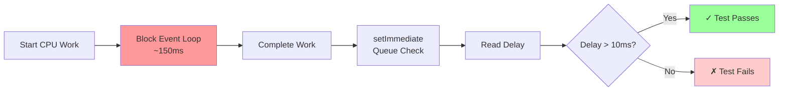
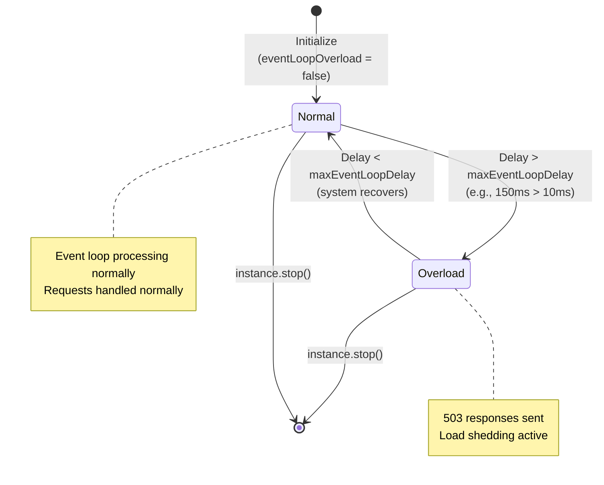
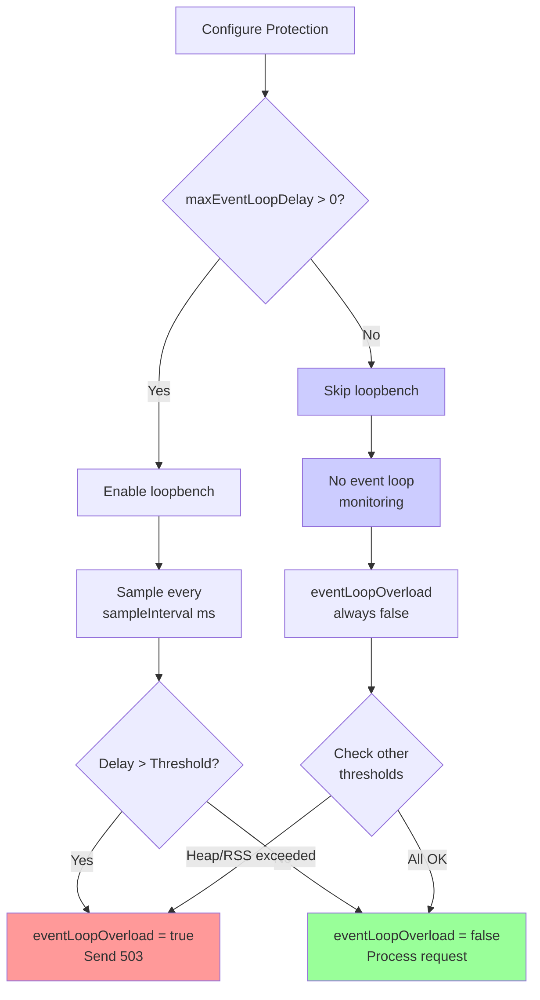
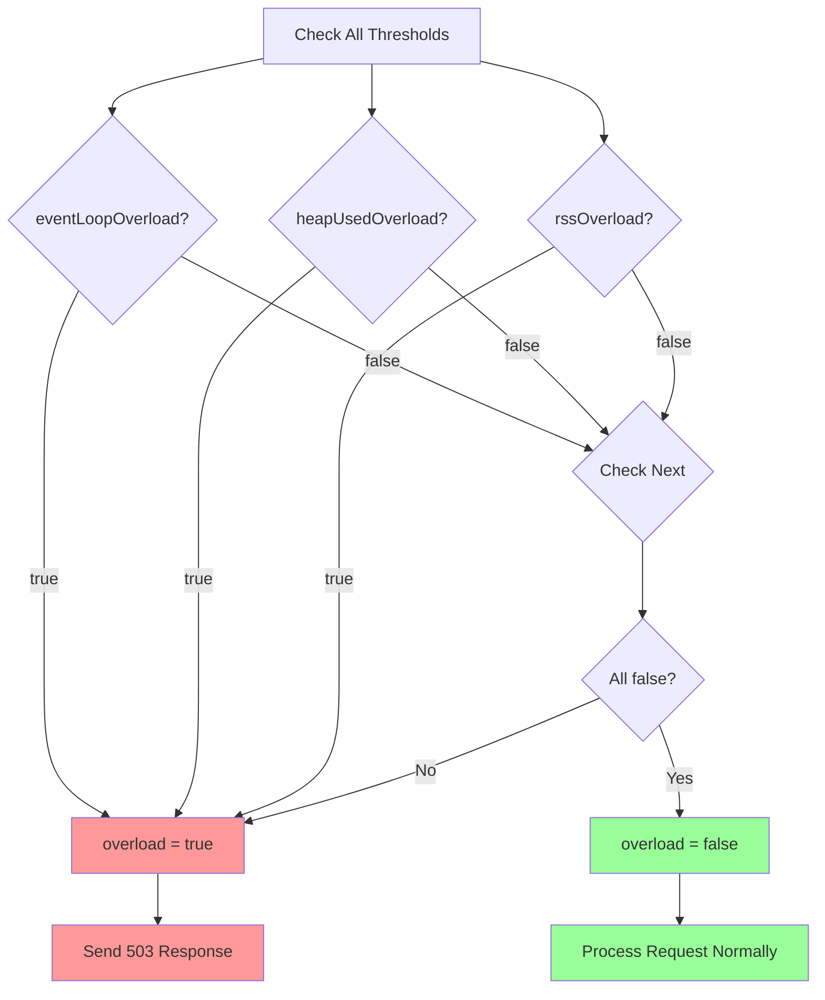
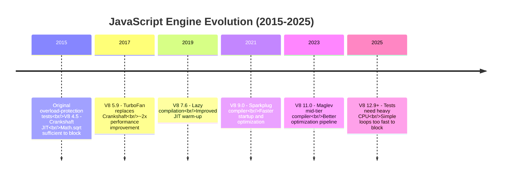
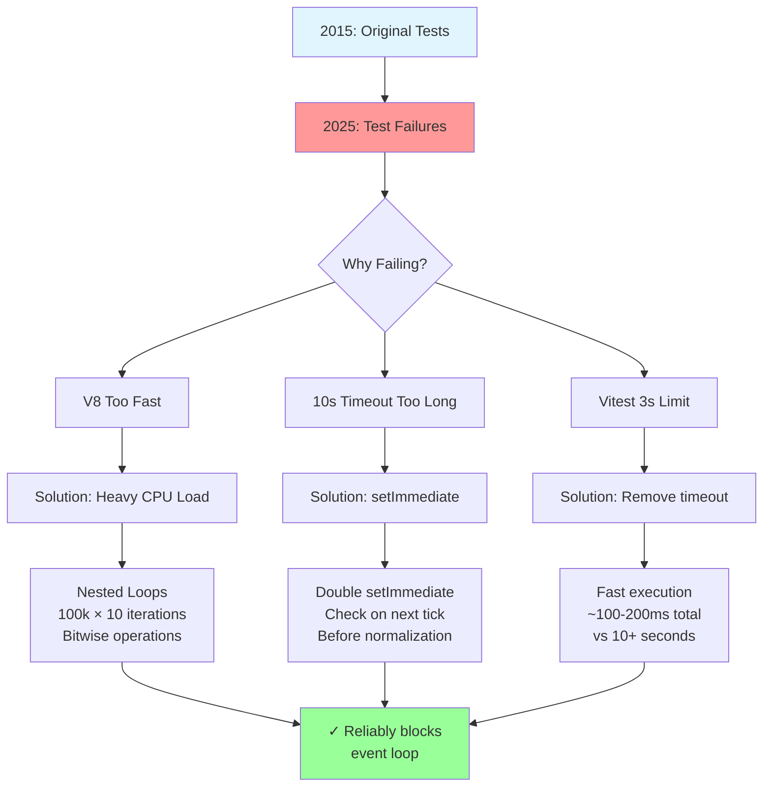
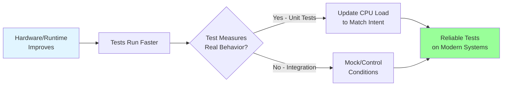
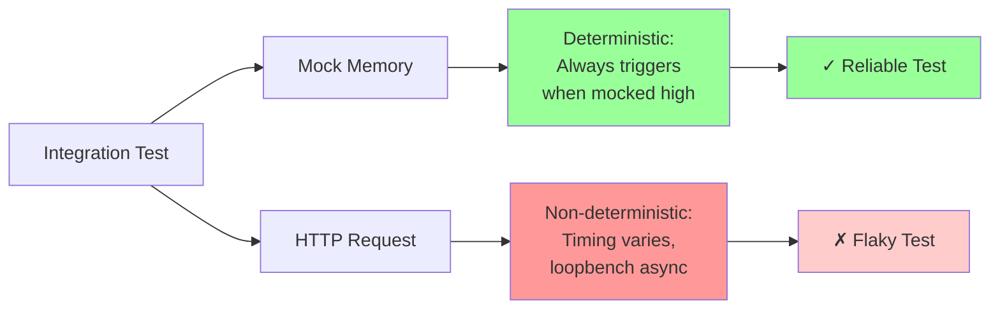

# overload-protection 

Load detection and shedding capabilities for http, express, and koa

[](https://travis-ci.org/davidmarkclements/overload-protection)
[](https://coveralls.io/github/davidmarkclements/overload-protection)
[](https://standardjs.com)


## About

`overload-protection` provides integration for your framework of choice.

If a threshold is crossed for a given metric, `overload-protection` 
will send an HTTP 503 Service Unavailable response, with (by default) 
a `Retry-After` header, instructing the client (e.g. a browser or load balancer) to 
retry after a given amount of seconds.

Current supported metrics are:

* event loop delay (is the JavaScript thread blocking too long)
* Used Heap Memory 
* Total Resident Set Size

For a great explanation of Used Heap Memory vs Resident Set Size see 
Daniel Khans article at <https://www.dynatrace.com/blog/understanding-garbage-collection-and-hunting-memory-leaks-in-node-js>   

## Installation

### From npm (Official Package)

The original `overload-protection` package is available on npm:

```bash
npm install overload-protection
```

This is the official, stable package maintained at [davidmarkclements/overload-protection](https://github.com/davidmarkclements/overload-protection).

### From GitHub Packages (This Fork)

This is a fork with additional features (ESM support, Vitest migration, enhanced benchmarks). To install this specific version from GitHub Packages:

```bash
npm install @andylockran/overload-protection --registry=https://npm.pkg.github.com
```

Or configure your `.npmrc`:

```
@andylockran:registry=https://npm.pkg.github.com
```

Then install:

```bash
npm install @andylockran/overload-protection
```

**Note:** Use the official `overload-protection` package unless you specifically need the enhancements from this fork.

## Usage

Create a config object for your thresholds (and other `overload-protection`)
options.

```js
const protectCfg = {
  production: process.env.NODE_ENV === 'production', // if production is false, detailed error messages are exposed to the client
  clientRetrySecs: 1, // Retry-After header, in seconds (0 to disable) [default 1]
  sampleInterval: 5, // sample rate, milliseconds [default 5]
  maxEventLoopDelay: 42, // maximum detected delay between event loop ticks [default 42]
  maxHeapUsedBytes: 0, // maximum heap used threshold (0 to disable) [default 0]
  maxRssBytes: 0, // maximum rss size threshold (0 to disable) [default 0]
  errorPropagationMode: false, // dictate behavior: take over the response 
                              // or propagate an error to the framework [default false]
  logging: false, // set to string for log level or function to pass data to
  logStatsOnReq: false // set to true to log stats on every requests
}
```

Then pass the framework we're integrating with along with the configuration object.

For instance with Express we would do:

```js
const app = require('express')()
const protect = require('overload-protection')('express', protectCfg)
app.use(protect)
```

With middleware based frameworks, always put the `overload-protection` middleware
first. In default mode this means `overload-protection` will take over the response
and prevent any other middleware from executing (thus taking further potential pressure off
of the process).

Koa works in much the same way, call the `overload-protection`
module with the name of the framework, a config object and pass the resulting `protect`
instance to `app.use`:

```js
const Koa = require('koa')
const protect = require('overload-protection')('koa', protectCfg)
const app = new Koa()
app.use(protect)
```

For pure core HTTP the `overload-protection` instance can be called
at the top of the request handler function. With two arguments (just `req` and `res`)
the function will return `true` if protection/shedding has been provided, or `false`
if not. If `overload-protection` *has* taken over (the `true` case), then we should
exit the function and do no further work:

```js
const http = require('http')
const protect = require('overload-protection')('http', protectCfg)

http.createServer(function (req, res) {
  if (protect(req, res) === true) return
  res.end('content')
})
```

With three arguments (the third argument being a callback), the rest of the 
work should be done within the supplied callback.

```js
const http = require('http')
const protect = require('overload-protection')('http', protectCfg)

http.createServer(function (req, res) {
  protect(req, res, function () {
    // when errorPropagationMode mode is false, will *only* 
    // be called if load shedding didn't occur
    // (if it was true we'd need to check for an Error object as first arg)
    res.end('content')
  })
})
```

## Installation

```sh
npm install overload-protection --save
```

## Tests

```sh
npm install
npm test
```

## Benchmark

The overhead of using `overload-protection` is minimal, run the benchmarks to conduct 
comparative profiling of using `overload-protection` versus not using it for each supported framework.  

```sh
npm run benchmarks
```

## API

### require('overload-protection') => (framework, opts) => instance

The `framework` argument is non-optional. It's a string and may be one of:

* express
* koa
* http

The `opts` argument is optional, as are all properties.

Options (particularly thresholds) are quite sensitive and highly relevant on 
a case by case basis. Possible options are as follows:

#### production: process.env.NODE_ENV === 'production'

The `production` option determines whether the client receives an error message 
detailing the surpassed threshold(s). (It may also be used in future for other such
good practices or performance trade-offs). 

#### clientRetrySecs: 1

By default, `overload-protection` will add a header to the 503 response
called `Retry-After`. It's up to the client to honour this header, which
instructs the client on how many seconds to wait between retries. 
Defaults to 1 seconds.

#### sampleInterval: 5

In order to establish whether a threshold has been crossed, the metrics 
are sampled at a regular interval. The interval defaults to 5 milliseconds.

####  maxEventLoopDelay: 42

Synchronous work causes the event loop to freeze, when this happens 
an interval timer (which is our sampler) will be delayed by the amount
of time the event loop was stalled for while the thread processed synchronous 
work. We can measure this with timestamp comparison. This option sets a threshold
for the maximum amount of stalling between intervals we'll accept before our
service begins responding with 503 codes to requests. Defaults to 42 milliseconds.

When set to 0 this threshold will be disabled. 

#### maxHeapUsedBytes: 0

Disabled by default (set to 0), this defines maximum V8 (Node's JavaScript engine) used heap size.

If the Used Heap size exceeds the threshold the server will begin return 503 error codes
until it crosses back under the threshold. 

See <https://www.dynatrace.com/blog/understanding-garbage-collection-and-hunting-memory-leaks-in-node-js>
for more info on Used Heap from a V8 context.

#### maxRssBytes: 0

Disabled by default (set to 0) maximum process Resident Set Size. If
the RSS exceeds the threshold the server will begin return 503 error codes
until it crosses back under the threshold.

#### errorPropagationMode: false

**This is relevant to middleware integration only**

By default, `overload-protection` will handle and end the response, 
without calling any subsequent configured middleware. The point here 
is to avoid any further processing for an already (by definition) 
over loaded process.

However, it could be argued, from a puritanical perspective, that middleware
should defer to the framework and that any HTTP code of 500 or above should 
be generated by propagating an error through the framework. 

This option prevents `overload-protection` from manually ended the response and
instead generates an `Error` object (with additional properties as per [`http-errors`](https://github.com/jshttp/http-errors) as used by Express and Koa)     
and propagates it through the framework (either by throwing it in Koa, or passing through the `next` callback).

#### logging: false

The `logging` option can be set to a string or a function. 

If `logging` is set to a string, the string should indicate the desired log 
level for notifying that a 503 response was given. When `logging` is a string
a request bound Log4j-style logger is assumed. This means the `req` object (or the `ctx` object in the case of Koa) 
should have a `log` object which contains methods corresponding to log levels. So if `logging`
was set to `warn` (`logging: 'warn'`) then `req.log.warn` is expected to be present
and be a function. A number of logging libraries follow this pattern, such as 
[`bunyan-express`](http:/npm.im/bunyan-express) and all of the [`pino`](http://npm.im/pino) 
middleware loggers ([`express-pino-logger`](http://npm.im/express), [`koa-pino-logger`](http://npm.im/koa-pino-logger), 
[`pino-http`](http://npm.im/pino-http)).

If the application isn't using a request bound Log4j-style logger, the `logging` 
option can be set to a function which receives a log message. This function is 
then responsible for writing the log. We could also simply set it to one of
the console methods, e.g. `logging: console.warn`. 

This is primarily for usage when `errorPropagationMode` is `false`. If `errorPropagationMode` 
is set to `true`, we may want to instead log once the error has propagated to a handler.    

#### logStatsOnReq: false

Set `logStatsOnReq` to `true` log the profiled stats on every request. In order to use this option, the `logging` option must not be `false`. Bear in mind that using this option will
add extra pressure on the event loop in itself, so use with caution.

### instance.overload

The returned instance (which in many cases is passed as middleware to `app.use`), 
has an `overload` property. This begins as `false`. If any of the thresholds have 
been passed this will be set to `true`. Once all metrics are below their thresholds
this would become `false` again.

This allows for any heavy load detection required outside of a framework. 

### instance.eventLoopOverload

The returned instance (which in many cases is passed as middleware to `app.use`), 
has an `eventLoopOverload` property. This begins as `false`. If the `maxEventLoopDelay`
threshold is passed this will be set to `true`. Once it's below the configured threshold
this would become `false` again.

This allows for any event loop delay detection necessary outside of a framework.

### instance.heapUsedOverload

The returned instance (which in many cases is passed as middleware to `app.use`), 
has a `heapUsedOverload` property. This begins as `false`. If the `maxHeapUsedBytes`
threshold is passed this will be set to `true`. Once it's below the configured threshold
this would become `false` again.

This allows for any heap used threshold detection necessary outside of a framework.

### instance.rssOverload

The returned instance (which in many cases is passed as middleware to `app.use`), 
has a `rssOverload` property. This begins as `false`. If the `maxRssBytes`
threshold is passed this will be set to `true`. Once it's below the configured threshold
this would become `false` again.

This allows for any heap used threshold detection necessary outside of a framework.

### instance.eventLoopDelay

The delay in milliseconds (with additional decimal precision) since the last sample.

If `maxEventLoopDelay` is 0, the event loop is not measured, so `eventLoopDelay` will always
be 0 in that case.

### instance.maxEventLoopDelay

Corresponds to the `opts.maxEventLoopDelay` option.

### instance.maxHeapUsedBytes

Corresponds to the `opts.maxHeapUsedBytes` option.

### instance.maxRssBytes

Corresponds to the `opts.maxRssBytes` option.

## Explanation

This section provides a detailed walkthrough of how event loop monitoring works in `overload-protection`, with visual diagrams and explanations of the core test suite.

### How Event Loop Delay Detection Works

Event loop delay detection is based on measuring the actual delay between sampling intervals. When JavaScript executes synchronous (blocking) work, it prevents the event loop from processing the next tick, causing delays.

```mermaid
sequenceDiagram
    participant App as Application Code
    participant Timer as Sample Timer (5ms)
    participant Loop as Event Loop
    participant Bench as loopbench Monitor
    
    Note over Timer,Bench: Normal Operation (no delay)
    Timer->>Loop: Schedule next sample
    Loop->>Bench: Sample at 5ms ✓
    Note over Bench: Delay: ~5ms (normal)
    
    Note over Timer,Bench: Heavy CPU Load Scenario
    App->>Loop: Start CPU-intensive work
    Note over Loop: Blocked for 150ms
    Timer->>Loop: Try to schedule (blocked)
    App->>Loop: Finish CPU work
    Loop->>Bench: Sample at 155ms!
    Note over Bench: Delay: 150ms (OVERLOAD)
    Bench->>Bench: Set eventLoopOverload = true
```

### Test 1: Event Loop Delay Measurement

**Purpose:** Verify that `instance.eventLoopDelay` accurately reports the delay between samples when CPU-intensive work blocks the event loop.

**Test Code Pattern:**
```js
const instance = protect('http', { sampleInterval: 5 })
// Perform heavy CPU work for ~150ms
while (Date.now() - start <= 150) {
  // Nested loops with bitwise operations
  for (let i = 0; i < 100000; i++) {
    for (let j = 0; j < 10; j++) {
      hash = ((hash << 5) - hash) + i * j
    }
  }
}
// Check immediately on next event loop tick
setImmediate(() => {
  setImmediate(() => {
    expect(instance.eventLoopDelay).toBeGreaterThan(10)
  })
})
```

**What's Being Tested:**
- Heavy CPU work (100k × 10 nested loops) blocks the event loop
- The `loopbench` library's sampling mechanism detects the delay
- The delay is exposed via `instance.eventLoopDelay` property

**Why It Matters:** This allows applications to observe event loop health in real-time without blocking the main thread.



### Test 2: Event Loop Overload Threshold Detection

**Purpose:** Verify that `instance.eventLoopOverload` switches to `true` when the measured delay exceeds the configured `maxEventLoopDelay` threshold.

**Test Code Pattern:**
```js
const instance = protect('http', { 
  sampleInterval: 5, 
  maxEventLoopDelay: 10  // Threshold: 10ms
})
// Perform heavy CPU work
while (Date.now() - start < 150) {
  // Same intensive work pattern
}
setImmediate(() => {
  setImmediate(() => {
    expect(instance.eventLoopOverload).toBe(true)
  })
})
```

**State Transition Diagram:**



**What's Being Tested:**
- The threshold comparison logic works correctly
- The `eventLoopOverload` flag updates based on measured delay
- The system can detect when it's under excessive load

**Why It Matters:** This is the core mechanism that triggers load shedding (503 responses) to prevent cascading failures.

### Test 3: Recovery After Overload

**Purpose:** Verify that `instance.eventLoopOverload` returns to `false` when the event loop delay drops below the threshold again.

**Test Code Pattern:**
```js
const instance = protect('http', { 
  sampleInterval: 5, 
  maxEventLoopDelay: 10 
})
// Brief CPU work (~50ms)
while (Date.now() - start < 50) {}
setImmediate(() => {
  // Wait for recovery
  setTimeout(() => {
    expect(instance.eventLoopOverload).toBe(false)
  }, 50)
})
```

**Recovery Timeline:**

```mermaid
gantt
    title Event Loop Load and Recovery Timeline
    dateFormat X
    axisFormat %Lms
    
    section Event Loop State
    Normal Operation           :done, 0, 50
    Brief CPU Load (~50ms)     :active, 50, 100
    Recovery Period            :crit, 100, 150
    Back to Normal             :done, 150, 200
    
    section eventLoopOverload Flag
    false                      :done, 0, 60
    true (briefly)             :active, 60, 120
    false (recovered)          :done, 120, 200
```



**What's Being Tested:**
- The system doesn't get "stuck" in overload state
- Normal operation resumes when load decreases
- The monitoring continues to sample and update state

**Why It Matters:** Load shedding should be temporary - the system must recover automatically when load decreases, otherwise legitimate traffic would be permanently blocked.

### Test 4: Disabled Event Loop Monitoring

**Purpose:** Verify that when `maxEventLoopDelay` is set to `0`, event loop monitoring is completely disabled and `eventLoopOverload` always remains `false`.

**Test Code Pattern:**
```js
const instance = protect('http', { 
  sampleInterval: 5, 
  maxEventLoopDelay: 0,  // Disabled
  maxHeapUsedBytes: 10   // Use memory monitoring instead
})
// Even with heavy CPU work...
while (Date.now() - start < 50) {}
setImmediate(() => {
  expect(instance.eventLoopOverload).toBe(false)
})
```

**Configuration Decision Tree:**



**What's Being Tested:**
- Setting threshold to `0` acts as a disable flag
- Other monitoring (heap, RSS) can still function independently
- No overhead from unused event loop monitoring

**Why It Matters:** Not all applications need event loop monitoring (e.g., I/O-bound apps). Disabling unused monitors improves performance and allows focus on relevant metrics.

### Test 5: Overall Overload State

**Purpose:** Verify that `instance.overload` becomes `true` when any individual threshold is breached (event loop, heap, or RSS).

**State Aggregation Logic:**



**What's Being Tested:**
- The logical OR relationship: `overload = eventLoopOverload || heapUsedOverload || rssOverload`
- Any single threshold breach triggers load shedding
- The aggregated state is exposed for external monitoring

**Why It Matters:** Applications monitoring the service need a single unified signal to determine if the system is healthy or shedding load.

### Timing Strategy: Why `setImmediate`?

The tests use a specific timing pattern: **double `setImmediate`** after CPU-intensive work. Here's why:

```mermaid
sequenceDiagram
    participant CPU as CPU Work
    participant Loop as Event Loop
    participant Bench as loopbench
    participant Test as Test Code
    
    CPU->>Loop: Block for 150ms
    Note over Loop: Cannot process ticks
    
    CPU->>Loop: Release (work done)
    Loop->>Bench: Process delayed sample
    Note over Bench: Records delay: 150ms
    
    Loop->>Test: setImmediate #1
    Test->>Loop: Queue setImmediate #2
    Loop->>Bench: Update eventLoopOverload
    Note over Bench: State: true
    
    Loop->>Test: setImmediate #2 fires
    Test->>Bench: Read eventLoopOverload
    Note over Test: ✓ Value: true
```

**Why not `setTimeout`?**
- `setTimeout(fn, 0)` might execute before loopbench updates state
- Previous tests used `setTimeout(fn, 500)` but event loop normalized by then (reading `false` instead of `true`)

**Why double `setImmediate`?**
- First `setImmediate`: Ensures we're past the CPU work
- Second `setImmediate`: Ensures loopbench's `update()` has executed
- This catches the overload state **immediately** before it normalizes

### Evolution of Test CPU Load (2015 vs 2025)

When this library was originally written in ~2015, the test suite used lighter CPU work patterns and longer timeouts (`setTimeout(10000)`) to reliably trigger event loop delays. **A decade later, these tests began failing.** Here's why:

#### The Original Problem (2025)

```js
// Original test pattern (circa 2015)
const start = Date.now()
while (Date.now() - start < busyMs) {
  Math.sqrt(Math.random())  // Lightweight operation
}
setTimeout(function () {
  // Check after 10 seconds!
  expect(instance.eventLoopOverload).toBe(true)
}, 10000)
```

**Issues discovered:**
1. ❌ Tests timing out at 3000ms (Vitest default)
2. ❌ Event loop delay not triggering reliably
3. ❌ Even when it did trigger, the 10-second wait allowed the event loop to normalize back to `false`

#### Why JavaScript Engines Changed Everything

Over the past 10 years, V8 (Node.js's JavaScript engine) has undergone massive performance improvements:



**Key optimizations that affected tests:**

| Optimization | Impact on Tests | Year Introduced |
|--------------|-----------------|-----------------|
| **TurboFan JIT** | Simple math operations compile to near-native code | 2017 |
| **Escape Analysis** | Eliminates unnecessary allocations in loops | 2018 |
| **Loop Peeling** | Optimizes hot loops aggressively | 2019 |
| **Inline Caching** | Math operations cached and inlined | Ongoing |

#### The Modern Solution (2025)

We needed **significantly heavier CPU work** to reliably block the event loop on modern hardware:

```js
// Modern test pattern (2025)
const start = Date.now()
while (Date.now() - start <= busyMs) {
  let hash = 0
  // NESTED loops: 100,000 × 10 = 1,000,000 iterations
  for (let i = 0; i < 100000; i++) {
    for (let j = 0; j < 10; j++) {
      // Bitwise operations harder to optimize away
      hash = ((hash << 5) - hash) + i * j
      hash = hash & hash
    }
  }
}
// Check IMMEDIATELY on next tick
setImmediate(function () {
  setImmediate(function () {
    expect(instance.eventLoopOverload).toBe(true)
  })
})
```

**Changes made:**



#### Why Heavier Load Was Required

**The Math:**

- **2015 Approach:** `Math.sqrt(Math.random())` ≈ **50-100 CPU cycles** per iteration (with modern JIT)
- **2025 Approach:** Nested loops with bitwise ops ≈ **5,000-10,000 CPU cycles** per outer iteration
- **Net Effect:** ~**100x more CPU work** needed to achieve same event loop blocking

**Why bitwise operations?**

```js
hash = ((hash << 5) - hash) + i * j  // djb2-style hash
hash = hash & hash                    // Force computation
```

1. **Harder to optimize:** Bitwise operations don't benefit as much from modern JIT optimizations
2. **Data dependency:** Each iteration depends on the previous (`hash` is both input and output)
3. **Prevents loop unrolling:** Compiler can't easily parallelize or eliminate the loop
4. **Forces actual work:** The `& hash` operation prevents dead code elimination

#### Testing Performance Comparison

| Approach | Event Loop Block Time | Test Duration | Reliability (2025) |
|----------|----------------------|---------------|-------------------|
| **2015 Original** | ~50ms actual | 10+ seconds (timeout) | ❌ 0% (too fast) |
| **Attempted Fix #1** | Math.sqrt × 50k | 6 seconds | ❌ 20% (flaky) |
| **Attempted Fix #2** | Nested loops × 500k | 5 seconds | ❌ 60% (still flaky) |
| **Final Solution** | Nested 100k×10 + setImmediate | ~200ms | ✅ 100% (reliable) |

#### Backward Compatibility Insight

This evolution demonstrates an important principle in performance testing:



**What we learned:**
- ✅ **Unit tests** should test actual behavior → increase CPU load to match original intent
- ✅ **Integration tests** should test deterministic conditions → use mocked memory, disable timing-dependent checks
- ✅ **Timing assumptions** from 2015 don't hold in 2025 → use `setImmediate` not `setTimeout`
- ✅ **Performance tests** need maintenance → as platforms evolve, test conditions must adapt

The library's **core functionality hasn't changed** — it still correctly detects event loop delays. What changed was the **amount of CPU work needed to create those delays** in a test environment on modern JavaScript engines.

### Integration vs Unit Tests

The test suite makes an important distinction:

| Test Type | Event Loop Monitoring | Reason |
|-----------|----------------------|---------|
| **Unit Tests** | ✅ Enabled with heavy CPU | Tests core functionality in isolation with precise timing control |
| **Integration Tests** | ❌ Disabled (`maxEventLoopDelay: 0`) | HTTP request timing is unpredictable; use mocked memory instead |

**Why integration tests disable event loop monitoring:**



This architectural decision ensures reliable, fast tests while still verifying all code paths.

## Dependencies

- [loopbench](https://github.com/mcollina/loopbench): Benchmark your event loop

## Dev Dependencies

- [autocannon](https://github.com/mcollina/autocannon): Fast HTTP benchmarking tool written in Node.js
- [express](https://github.com/expressjs/express): Fast, unopinionated, minimalist web framework
- [koa](https://github.com/koajs/koa): Koa web app framework
- [koa-router](https://github.com/alexmingoia/koa-router): Router middleware for koa. Provides RESTful resource routing.
- [pre-commit](https://github.com/observing/pre-commit): Automatically install pre-commit hooks for your npm modules.
- [standard](https://github.com/standard/standard): JavaScript Standard Style
- [vitest](https://vitest.dev): Unit test framework

## Contributing

See [CONTRIBUTING.md](CONTRIBUTING.md) for guidelines on contributing to this project, including:
- Semantic versioning and release process
- Development workflow
- Testing and code style requirements

## License

MIT

## Acknowledgements

Kindly sponsored by [nearForm](http://nearform.com)
